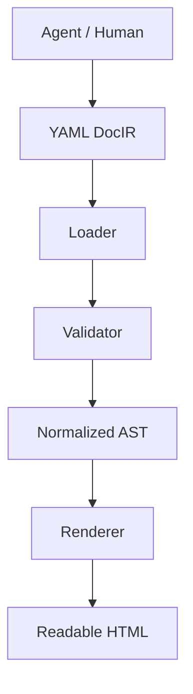
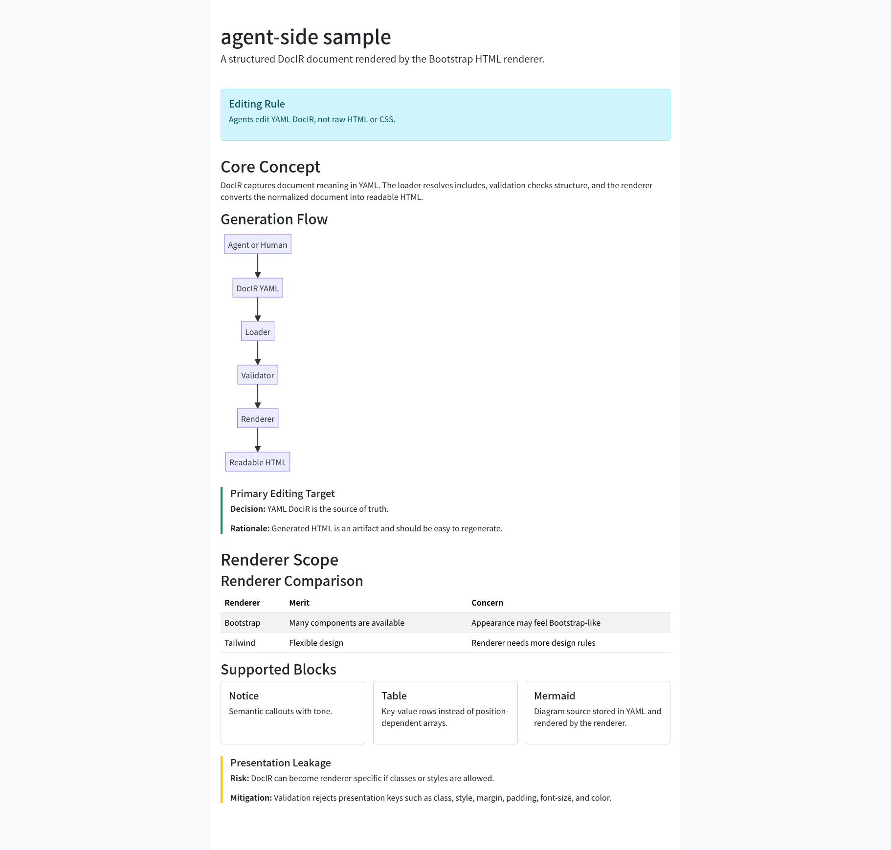
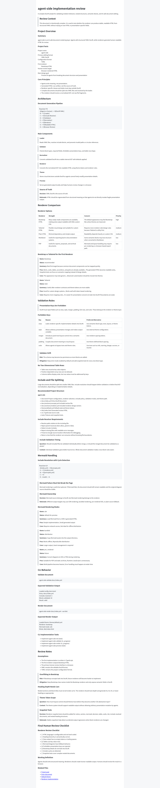
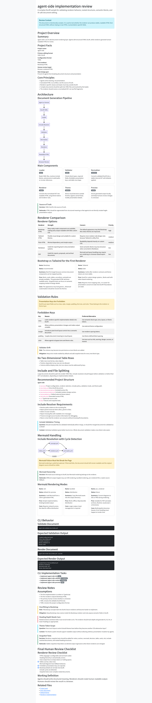

# agent-side

**agent-side** is an AI-safe document and site generation layer.

It is designed for workflows where AI agents generate or edit documents, but humans still need to review the result comfortably and safely.

Agents write structured meaning.  
Renderers generate human-readable output.  
Humans review the rendered result in a browser.

---

## Concept

AI agents should not directly edit fragile HTML, CSS, or loosely structured Markdown.

Instead, they should edit a structured document IR written in YAML.



The generated HTML is an output artifact.
It is not the primary editing target.

---

## Why agent-side?

Markdown is easy to write, but it becomes ambiguous as documents grow.

Common problems include:

* Tables become hard to maintain.
* Custom extensions differ between renderers.
* Notices, cards, tabs, accordions, and diagrams are not standardized.
* AI agents may break layout or semantics when editing raw HTML.
* Humans are forced to review long AI-generated Markdown directly.
* Visual structure is hard to understand in plain text.

agent-side introduces a structured document layer between AI output and rendered HTML.

---

## Core Principle

> Agents write meaning, not presentation.

For example, an agent should write this:

```yaml
type: notice
tone: warning
title: Presentation Leakage
body: DocIR must not contain renderer-specific class names.
```

The renderer decides how it should look.

For example, the current Bootstrap renderer may output an alert.
A future Tailwind renderer could output a styled callout from the same DocIR.

The agent should not write Bootstrap classes, Tailwind utility classes, inline styles, or arbitrary HTML layout.

---

## What agent-side Is

agent-side is:

* a structured document IR for AI-assisted workflows
* a renderer layer for human-readable review output
* a safer alternative to letting agents edit raw HTML
* a way to generate readable documents, reports, notes, and small static pages
* a foundation for future render targets

agent-side is currently under active implementation.
The available renderers are Plain HTML, Bootstrap HTML, and Markdown.
Some block types described below are design goals, not complete features yet.

---

## What agent-side Is Not

agent-side is not:

* a full website builder
* a WYSIWYG editor
* a Markdown extension format
* a replacement for every static site generator
* a Bootstrap clone
* an HTML5 specification wrapper
* a free-form CSS layout system

The goal is not to support every possible visual expression.

The goal is to let AI agents safely produce structured documents that humans can comfortably review.

---

## Document Format

The main document format is YAML.

Example:

```yaml
page:
  title: agent-side sample
  lang: en
  lead: A complex DocIR sample for validating renderer behavior, nested structures, semantic blocks, and AI-safe document editing.

  blocks:
    - type: notice
      tone: info
      title: Editing Rule
      body: Agents edit YAML DocIR, not raw HTML or CSS.

    - type: section
      title: Core Concept
      blocks:
        - type: paragraph
          text: DocIR captures document meaning in YAML.

        - type: mermaid
          title: Generation Flow
          diagram: |
            flowchart LR
              A[Agent or Human] --> B[DocIR YAML]
              B --> C[Loader]
              C --> D[Validator]
              D --> E[Renderer]
              E --> F[Readable HTML]

        - type: cards
          title: Main Components
          layout: 3col
          items:
            - title: Loader
              body: Reads YAML files, resolves include blocks, and prevents invalid paths or circular references.
              badge: input
            - title: Validator
              body: Checks block types, required fields, forbidden presentation keys, and table row shape.
              badge: safety
            - title: Normalizer
              body: Converts validated DocIR into a stable internal AST with defaults applied.
              badge: structure
            - title: Renderer
              body: Converts the normalized AST into readable HTML using theme tokens and renderer rules.
              badge: output
            - title: Theme
              body: Stores visual decisions outside DocIR so agents cannot freely modify presentation details.
              badge: external
            - title: Preview
              body: Serves generated output locally and helps humans review changes in a browser.
              badge: review

        - type: decision
          title: Primary Editing Target
          decision: YAML DocIR is the source of truth.
          rationale: Generated HTML is an artifact and should be easy to regenerate.
```

Screenshots:



---

## Project Configuration

Project configuration should be stored in `docir.toml`.

Example:

```toml
[site]
title = "agent-side sample"
lang = "en"
entry = "docs/index.yml"
out_dir = "dist"

[renderer]
name = "plain"
theme = "default"

[renderer.mermaid]
mode = "cdn"

[include]
base_dir = "docs"
allow_parent = false

[validation]
strict = true
unknown_keys = "error"

[theme]
path = "themes/default.yml"
```

---

## Suggested Directory Structure

```text
agent-side/
  docir.toml
  docs/
    index.yml
    sections/
      concept.yml
      renderer.yml
  themes/
    default.yml
  dist/
  src/
  tests/
```

---

## File Splitting

Large documents can be split into multiple YAML files.

Use include blocks:

```yaml
type: include
src: ./sections/concept.yml
```

Include resolution is handled by the loader.

The renderer should receive a fully resolved normalized AST and should not care about file boundaries.

The loader should detect:

* missing include files
* circular includes
* parent directory traversal when disabled
* invalid YAML
* invalid included block types

---

## Rendering

The same DocIR is intended to be renderable into multiple targets.

Currently available:

* Plain HTML
* Bootstrap HTML
* Markdown

Planned or exploratory renderers:

* Tailwind HTML
* PDF
* email HTML
* GitHub Pages
* WordPress blocks

Select the renderer with `[renderer].name` in `docir.toml`:

```toml
[renderer]
name = "plain"
```

Supported values:

* `plain`
* `bootstrap`
* `markdown`

Plain HTML is the baseline renderer and works well with the default `single` output mode.
Bootstrap HTML is the enhanced browser preview renderer.
Markdown exports DocIR back into readable Markdown.

---

## Output Samples

Sample files:

* [Source DocIR](samples/sample.yml)
* [Default theme](samples/themes/default.yml)

### Plain HTML renderer preview

<p>
  <a href="samples/plain/plain.png">
    
  </a>
</p>

* [Plain HTML sample](samples/plain/dist/index.html)
* [Plain HTML screenshot](samples/plain/plain.png)

### Bootstrap HTML renderer preview

<p>
  <a href="samples/bootstrap/bootstrap.png">
    
  </a>
</p>

* [Bootstrap HTML sample](samples/bootstrap/dist/index.html)
* [Bootstrap screenshot](samples/bootstrap/bootstrap.png)

### Markdown renderer preview

* [Markdown sample](samples/markdown/dist/index.md)

---

## Theme

Visual rendering rules should be stored outside DocIR.

Example:

```yaml
name: default

blocks:
  page:
    container: lg

  section:
    spacing: normal
    heading: h2

  cards:
    gap: normal
    border: true
    shadow: sm
    radius: md

  notice:
    style: soft
```

Theme support is still being expanded.

Currently applied by the Bootstrap renderer:

* `tokens.accent`
* `tokens.surface`
* `tokens.text`
* `blocks.page.container`
* `blocks.section.spacing`

Other theme fields in the example are accepted as forward-compatible design settings, but they are not all applied yet.
The renderer maps implemented theme tokens to actual output-specific styles.

DocIR may contain limited semantic layout hints such as:

```yaml
layout: 2col
width: wide
align: center
tone: warning
priority: high
```

DocIR must not contain:

* `class`
* `style`
* `margin`
* `padding`
* `font-size`
* `color`
* renderer-specific class names

---

## Mermaid

DocIR may contain Mermaid source.

Example:

```yaml
type: mermaid
title: Generation Flow
diagram: |
  flowchart TD
    A[Agent] --> B[DocIR YAML]
    B --> C[Validator]
    C --> D[Renderer]
    D --> E[Readable HTML]
```

DocIR stores the diagram source.

The renderer decides how Mermaid is rendered.

Mermaid mode is configurable, but only `cdn` is implemented today.

Implemented:

* `cdn`

Accepted by configuration but not implemented yet:

* `bundled`
* `pre_rendered`

Those unimplemented modes fail explicitly instead of silently producing incomplete output.

Mermaid rendering failure should not break the entire document.

Recommended fallback behavior:

* show the Mermaid source in a visible block
* display a clear error message near the diagram
* keep the rest of the document usable
* optionally expose the original Mermaid source for debugging

---

## Tables

Tables must use key-value rows.

Two-dimensional arrays are forbidden because they are position-dependent and easy for AI agents to break.

Do not use:

```yaml
rows:
  - [Bootstrap, easy, good]
  - [Tailwind, flexible, complex]
```

Use this instead:

```yaml
type: table
title: Renderer Comparison
columns:
  - key: renderer
    label: Renderer
  - key: merit
    label: Merit
  - key: concern
    label: Concern
rows:
  - renderer: Bootstrap
    merit: Many components are available
    concern: Appearance may feel Bootstrap-like
  - renderer: Tailwind
    merit: Flexible design
    concern: Renderer needs more design rules
```

The validator should reject array-based table rows.

---

## Initial Block Types

The architecture should allow these semantic block types.

Currently implemented block types include:

* `section`
* `paragraph`
* `summary`
* `points`
* `list`
* `notice`
* `cards`
* `table`
* `compare`
* `keyValue`
* `code`
* `command`
* `output`
* `fileTree`
* `mermaid`
* `decision`
* `todo`
* `issue`
* `risk`
* `assumption`
* `constraint`
* `openQuestion`
* `checklist`
* `quote`
* `reference`
* `include`

Planned or not fully implemented yet:

* `page`
* `text`
* `steps`
* `definition`
* `glossary`
* `diff`
* `figure`
* `linkList`

The first implementation does not need to support all of them completely, but the architecture should allow them to be added cleanly.

---

## Renderer Output Requirements

Generated HTML should be readable, stable, and structurally correct.

### HTML Language

The renderer must not hard-code `lang="en"`.

The HTML language should be configurable from project configuration or page metadata.

Preferred order:

1. `page.lang` in DocIR
2. `[site].lang` in `docir.toml`
3. fallback value such as `en`

Example:

```html
<html lang="ja">
```

### Heading Hierarchy

The renderer must preserve a correct heading hierarchy.

Do not render every block title as `h2`.

The renderer should track nesting depth and choose headings accordingly.

Example:

```html
<h1>Page Title</h1>
<section>
  <h2>Top Level Section</h2>
  <section>
    <h3>Nested Block Title</h3>
  </section>
</section>
```

Visual size may be adjusted with CSS classes, but the semantic heading level should remain correct.

### Clean Class Output

The renderer should avoid unstable or noisy HTML output.

Avoid:

```html
<section class="doc-section ">
```

Prefer:

```html
<section class="doc-section">
```

Class names should be joined safely and empty class tokens should be removed.

### Accessibility

Use semantic HTML where practical.

Examples:

* `main` for the document body
* `section` for document sections
* `article` for standalone semantic blocks such as decisions or risks
* `table`, `thead`, `tbody`, `th`, and `td` for tables
* `scope="col"` for table headers

Notice-like blocks may use `role="note"` by default.

Use stronger roles such as `role="alert"` only when the content should interrupt assistive technology users.

---

## CLI Goals

The CLI currently provides:

```text
agent-side init
agent-side validate
agent-side render
agent-side preview
```

`preview` renders the document and serves the generated output locally.
Automatic watching and live re-rendering are still planned.

Expected usage:

```bash
npx agent-side init
npx agent-side validate docs/index.yml
npx agent-side render docs/index.yml --out dist
npx agent-side preview
```

Renderer selection is configured in `docir.toml`:

```toml
[renderer]
name = "plain"      # plain | bootstrap | markdown
```

Render output modes:

```bash
npx agent-side render docs/index.yml --out dist --mode single
npx agent-side render docs/index.yml --out dist --mode bundle
npx agent-side render docs/index.yml --out dist --mode site
```

`single` is the default. HTML renderers write `dist/index.html`; the Markdown renderer writes `dist/index.md`.
`bundle` and `site` currently write `index.html` plus `assets/agent-side.css`.

---

## Installation

Install from npm:

```bash
npm install -D agent-side
```

Or run it directly:

```bash
npx agent-side --help
```

The package exposes the `agent-side` CLI and reusable ESM library APIs.

---

## Library Usage

Use the high-level project API when you want agent-side to load config, resolve includes, render, and write output:

```ts
import { renderProject } from "agent-side";

await renderProject({
  configPath: "docir.toml",
});
```

Use lower-level APIs when you need direct control:

```ts
import {
  loadConfig,
  loadDoc,
  normalizeDoc,
  renderBootstrapHtml,
  validateDoc,
} from "agent-side";

const config = await loadConfig("docir.toml");
const doc = await loadDoc(config.site.entry, config);
const validDoc = validateDoc(doc, config);
const ast = normalizeDoc(validDoc);
const html = renderBootstrapHtml(ast, config);
```

Additional entry points:

```ts
import { renderProject } from "agent-side/core";
import { renderBootstrapHtml } from "agent-side/renderer/bootstrap";
import { renderPlainDocument } from "agent-side/renderer/plain";
import { renderMarkdownDocument } from "agent-side/renderer/markdown";
```

---

## npm Package

The npm package is named `agent-side`.

Package build output is separate from rendered document output:

```text
lib/   TypeScript build output for npm publication
dist/  Generated document output from `agent-side render`
```

`dist/` remains reserved for generated review HTML or Markdown. The npm `bin`, `exports`, and `types` fields point to compiled files under `lib/`.

Published package contents are limited to:

```text
lib/
templates/
themes/
README.md
LICENSE
package.json
```

Before publishing, verify the package locally:

```bash
pnpm typecheck
pnpm test
pnpm build
npm pack --dry-run
```

Do not commit generated `lib/` or `dist/` output.

---

## Suggested TypeScript Stack

Use TypeScript for the first implementation.

Currently used libraries include:

* `typescript`
* `tsx`
* `zod`
* `yaml`
* `smol-toml`
* `commander`
* `pathe`
* `html-escaper`
* `sirv`
* `vite`
* `vitest`

Planned or optional libraries under consideration:

* `consola`
* `fs-extra`
* `chokidar`
* `eta`
* `mermaid`
* `happy-dom`
* `eslint`
* `prettier`

---

## Implementation Order

Recommended order:

1. Create project structure.
2. Load `docir.toml`.
3. Load YAML DocIR.
4. Resolve include blocks.
5. Define Zod schemas.
6. Validate DocIR.
7. Normalize into AST.
8. Implement Bootstrap renderer.
9. Output `dist/index.html`.
10. Add snapshot tests.
11. Add preview server.
12. Add Mermaid rendering support.
13. Add theme support.
14. Expand block types.

---

## Responsibilities

### Loader

The loader is responsible for:

* reading YAML files
* resolving includes
* preventing invalid paths
* detecting circular includes
* returning a complete unresolved or resolved document tree

### Validator

The validator is responsible for:

* checking block types
* rejecting invalid fields
* rejecting unknown keys in strict mode
* rejecting array-based table rows
* checking required fields
* validating config and theme files

### Normalizer

The normalizer is responsible for:

* converting valid DocIR into a stable internal AST
* applying defaults
* resolving shorthand forms if supported
* preparing data for renderer consumption

### Renderer

The renderer is responsible for:

* converting AST into HTML
* applying theme tokens
* escaping unsafe text
* rendering block types
* including required assets
* handling Mermaid rendering mode
* generating readable output

### Preview

The preview system is responsible for:

* serving generated HTML locally
* making human review easy

Planned preview capabilities:

* watching YAML, theme, and config changes
* re-rendering on change

---

## Testing

Renderer snapshot tests should cover at least:

* notice
* section
* mermaid
* decision
* table
* cards
* risk
* include-resolved documents
* nested heading structures

Snapshot tests should verify stable HTML output and prevent accidental renderer regressions.

---

## Product Definition

agent-side is an AI-safe document rendering layer.

Agents write structured meaning.
Renderers create human-readable output.
Humans review the result in a browser.

The core value is not static site generation itself.

The core value is preventing AI agents from breaking documents while still allowing them to express rich information structures.

## License

This project is licensed under the MIT License.

See [LICENSE](LICENSE) for details.
