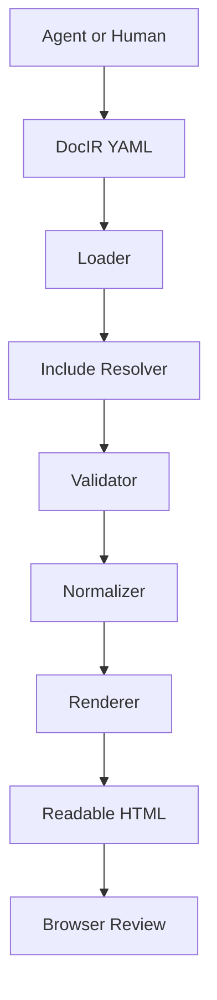
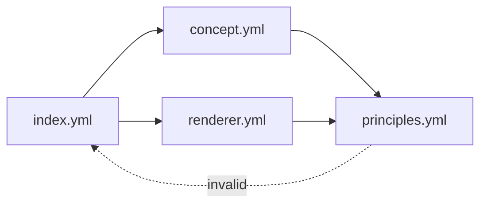

# agent-side implementation review

A complex DocIR sample for validating renderer behavior, nested structures, semantic blocks, and AI-safe document editing.

## Review Context

> This document is intentionally complex. It is used to test whether the renderer can produce stable, readable HTML from structured YAML without relying on raw HTML or presentation-specific fields.

## Project Overview

### Summary

agent-side is an AI-safe document rendering layer. Agents edit structured YAML DocIR, while renderers generate human-readable HTML for review.

### Project Facts

- **Project name:** agent-side
- **Primary editing format:** YAML DocIR
- **Configuration format:** TOML
- **First renderer:** Bootstrap HTML
- **Human review target:** Browser-rendered HTML
- **Main design goal:** Prevent AI agents from breaking document structure and presentation

### Core Principles

- Agents write meaning, not presentation.
- Generated HTML is an artifact, not the source of truth.
- Renderer-specific classes and styles must stay outside DocIR.
- Complex documents should be split into YAML files and resolved by the loader.
- The renderer should receive a normalized AST, not raw file fragments.

## Architecture

### Document Generation Pipeline



### Main Components

### Loader

Reads YAML files, resolves include blocks, and prevents invalid paths or circular references.

### Validator

Checks block types, required fields, forbidden presentation keys, and table row shape.

### Normalizer

Converts validated DocIR into a stable internal AST with defaults applied.

### Renderer

Converts the normalized AST into readable HTML using theme tokens and renderer rules.

### Theme

Stores visual decisions outside DocIR so agents cannot freely modify presentation details.

### Preview

Serves generated output locally and helps humans review changes in a browser.

### Source of Truth

**Decision:** YAML DocIR is the source of truth.

**Rationale:** HTML should be regenerated from structured meaning so that agents do not directly mutate fragile presentation output.

## Renderer Comparison

### Renderer Options

| Renderer | Strength | Concern | Priority |
| --- | --- | --- | --- |
| Bootstrap HTML | Many ready-made components are available, making early output readable with little custom CSS. | The default appearance may feel Bootstrap-like unless themes are improved. | high |
| Tailwind HTML | Flexible visual design and suitable for custom themes. | Requires more renderer-side design rules because Tailwind is utility-first. | medium |
| Plain HTML | Minimal dependency and simple output. | Readability depends heavily on custom CSS. | medium |
| Markdown | Useful for exporting back to documentation systems. | Some semantic blocks may lose structure when converted to Markdown. | low |
| PDF | Useful for reports, proposals, and archival documents. | Mermaid and layout handling may require pre-rendering or a browser-based export path. | low |

### Bootstrap vs Tailwind for the First Renderer

- **name:** Bootstrap
- **status:** recommended
- **summary:** Best first target because common document components can be mapped quickly.
- **pros:** Alerts, cards, tables, accordions, and grids are already available., The generated HTML becomes readable early., Snapshot tests can focus on semantic mapping instead of design details.
- **cons:** The appearance may look generic., Advanced customization should be moved into themes.

- **name:** Tailwind
- **status:** later
- **summary:** Useful after renderer contracts and theme tokens are more stable.
- **pros:** Good for custom design systems., Works well with token-based rendering.
- **cons:** Requires more mapping rules., It is easier for presentation concerns to leak into DocIR if boundaries are weak.

## Validation Rules

### Presentation Keys Are Forbidden

> DocIR must reject fields such as class, style, margin, padding, font-size, and color. These belong to the renderer or theme layer.

### Forbidden Keys

| Key | Reason | Preferred Alternative |
| --- | --- | --- |
| class | Leaks renderer-specific implementation details into DocIR. | Use semantic block type, tone, layout, or theme tokens. |
| style | Allows arbitrary presentation changes and makes output unstable. | Use external theme configuration. |
| margin | Introduces pixel-level layout control into a semantic document. | Use renderer spacing tokens. |
| padding | Couples document meaning to visual layout. | Use theme-defined block spacing. |
| color | Allows agents to bypass tone and theme rules. | Use tone such as info, warning, danger, success, or neutral. |

### Validator Drift

**Risk:** The schema may become too permissive as more blocks are added.

**Mitigation:** Keep strict mode enabled by default and add snapshot tests for every new block type.

### No Two-Dimensional Table Rows

- Table rows must be key-value objects.
- Position-dependent array rows are not allowed.
- Columns define display order, but row values must be addressed by keys.

## Include and File Splitting

Large documents should be split into smaller YAML files. Include resolution should happen before validation or before final AST normalization, depending on implementation details.

### Recommended Project Structure

**agent-side**

- `docir.toml` Project configuration, renderer selection, include policy, validation mode, and theme path.
- `docs/index.yml` Entry DocIR document.
- `docs/sections/concept.yml` Included section file.
- `docs/sections/renderer.yml` Included renderer design section.
- `themes/default.yml` Default external theme tokens.
- `dist/index.html` Generated review HTML.
- `src/` TypeScript source code.
- `tests/` Fixtures and snapshot tests.

### Include Resolver Requirements

- Resolve paths relative to the including file.
- Reject parent traversal when allow_parent is false.
- Detect circular includes.
- Report missing files with readable error messages.
- Preserve enough source location information for debugging.
- Return a tree that the renderer can consume without knowing file boundaries.

### Include Validation Timing

**Question:** Should included files be validated individually before merge, or should the merged document be validated as a whole?

**Context:** Individual validation gives better local errors. Whole-document validation makes cross-block rules easier.

## Mermaid Handling

### Include Resolution with Cycle Detection



### Mermaid Failure Must Not Break the Page

> Mermaid rendering is useful but optional. If Mermaid fails, the document should still remain readable and the original diagram source should be visible.

### Mermaid Ownership

**Decision:** Mermaid source belongs to DocIR, but Mermaid rendering belongs to the renderer.

**Rationale:** Different output targets may use CDN rendering, bundled rendering, pre-rendered SVG, or plain source fallback.

### Mermaid Rendering Modes

- **name:** cdn
- **status:** default-for-preview
- **summary:** Load Mermaid from a CDN in generated HTML.
- **pros:** Simple implementation, Small generated output
- **cons:** Requires network access, Not ideal for offline distribution

- **name:** bundled
- **status:** distribution
- **summary:** Copy Mermaid assets into the output directory.
- **pros:** Works offline, Reproducible distribution
- **cons:** Larger output, Asset management is required

- **name:** pre_rendered
- **status:** future
- **summary:** Convert diagrams to SVG or PNG during rendering.
- **pros:** Suitable for PDF and static archives, Runtime JavaScript is unnecessary
- **cons:** Build pipeline becomes heavier, Error handling must happen at render time

## CLI Behavior

### Validate Document

```bash
agent-side validate docs/index.yml

```

### Expected Validation Output

```
Loaded config: docir.toml
Entry: docs/index.yml
Includes resolved: 3
Blocks validated: 42
Result: valid

```

### Render Document

```bash
agent-side render docs/index.yml --out dist

```

### Expected Render Output

```
Loaded theme: themes/default.yml
Renderer: bootstrap
Mermaid mode: cdn
Wrote: dist/index.html

```

### CLI Implementation Tasks

- Implement agent-side init (todo)
- Implement agent-side validate (in_progress)
- Implement agent-side render (in_progress)
- Implement agent-side preview (todo)

## Review Notes

### Assumptions

- The first implementation is written in TypeScript.
- The first renderer outputs Bootstrap HTML.
- The primary human review interface is a browser.
- YAML remains the editable DocIR format.
- TOML remains the project configuration format.

### Overfitting to Bootstrap

**Risk:** If Bootstrap concepts leak into DocIR, future renderers will become harder to implement.

**Mitigation:** Keep Bootstrap class names inside the Bootstrap renderer and only expose semantic fields in DocIR.

### Heading Depth Needs Care

Nested sections and block titles must not all render as h2. The renderer should track depth and generate h2, h3, h4, or lower headings as appropriate.

### Theme Token Scope

**Question:** How much layout control should themes have before they become another CSS abstraction layer?

**Context:** The theme system should support readable output without allowing arbitrary presentation mutation by agents.

### Snapshot Tests

**Decision:** Renderer snapshot tests should be added for notice, section, mermaid, decision, table, cards, risk, include-resolved documents, and nested heading structures.

**Rationale:** Stable snapshots help detect accidental output regressions when block renderers are changed.

## Final Human Review Checklist

### Renderer Review Checklist

- [ ] HTML language is configurable and not hard-coded.
- [ ] Heading hierarchy is semantically correct.
- [ ] Class output has no empty tokens or trailing spaces.
- [x] Tables use key-value rows.
- [ ] Mermaid diagrams have fallback behavior.
- [x] Forbidden presentation keys are rejected.
- [x] Bootstrap details do not leak into DocIR.
- [ ] Include cycles are detected.
- [ ] Snapshot tests cover complex nested documents.

### Working Definition

Agents should write structured meaning. Renderers should create human-readable output. Humans should review the result in a browser.

### Related Files

- [Project goal](docs/goal.md)
- [Entry document](docs/index.yml)
- [Default theme](themes/default.yml)
- [Renderer implementation](src/renderer/bootstrap/)
